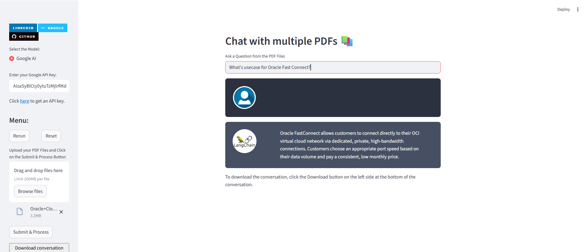

## Create Virtual Environment

```bash
python -m venv myenv
myenv/scripts/activate
```

## Install Required Libraries
```bash
pip install -r requirements.txt
```

## Run the Application
```bash
streamlit run app.py
```

## RAG Chatbot Response
